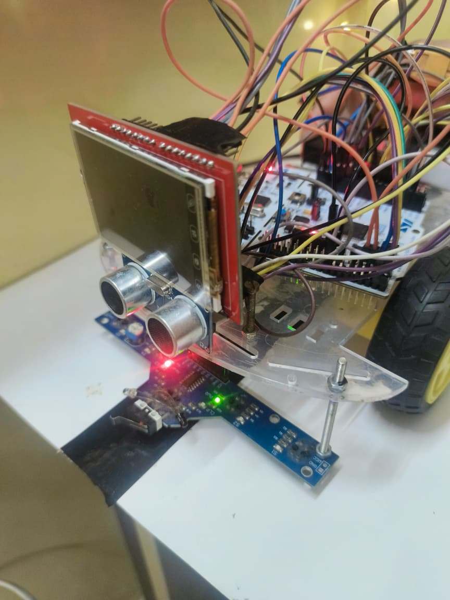
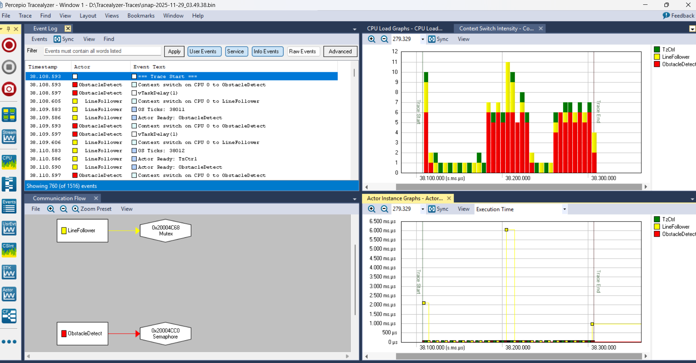
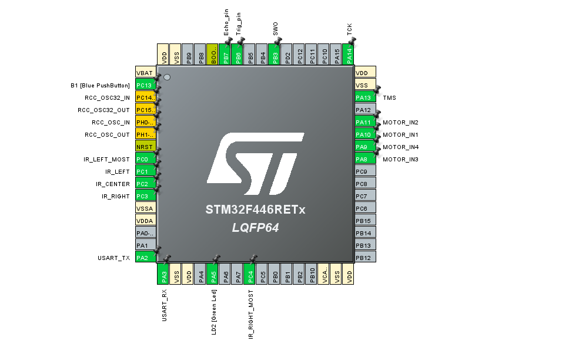
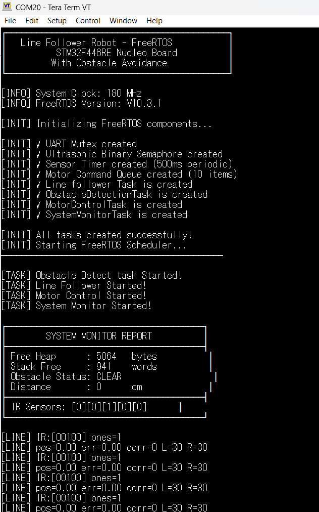

# FreeRTOS-Based Line Follower Robot with Obstacle Avoidance (STM32F446RE)

## Project Overview

This project implements a fully autonomous Line Follower Robot with Obstacle Avoidance, built using FreeRTOS on the STM32F446RE microcontroller [web:5]. The robot tracks a black line using a 5-IR sensor array, performs PID-based steering, and automatically detects and avoids obstacles using an HC-SR04 ultrasonic sensor [web:10]. The system uses multiple real-time tasks, inter-task communication via queues, and hardware PWM motor control for smooth navigation.

## Key Features

- **FreeRTOS Multitasking**: Separate tasks for Line Detection, Motor Control, Obstacle Detection, Timer Service, and System Monitoring
- **PID Line Control**: Uses proportional + derivative steering correction to precisely follow curves
- **Ultrasonic Obstacle Avoidance**: Automatically stops and reroutes when an object is detected
- **Queue-Based Motor Commands**: Clean, decoupled control system using a MotorCommandQueue
- **Real-Time Diagnostics**: Live task-state monitoring using Percepio Tracealyzer and UART logs using TeraTerm [web:5]
- **Fail-Safe Design**: Stack monitoring, distance timeouts, and sensor sanity checks

## Hardware Connections

### Microcontroller
STM32F446RE (Nucleo-F446RE)

### Sensors & Actuators

| Component | Pins Used | Notes |
|-----------|-----------|-------|
| 5-IR Line Sensor Array | PC0, PC1, PC2, PC3, PC4 | Digital inputs (active LOW) |
| Ultrasonic HC-SR04 | Trigger → PB6, Echo → PB7 (TIM4 CH2) | Input Capture used for distance |
| Motor Driver (L298N / Dual H-Bridge) | IN1→PA10, IN2→PA11, IN3→PA8, IN4→PA9 | Driven via TIM1 PWM |
| UART Debugging | PA2 (TX), PA3 (RX) | Used with TeraTerm |
| FreeRTOS Tick Timer | SysTick | Default configuration |

### Additional Tools

- Percepio Tracealyzer 4 (RTOS task visualization) [web:7]
- STM32CubeIDE (build + flash)
- TeraTerm (UART monitoring)

## Software Design

### 1. PID-Based Line Following

The robot calculates an error value based on IR readings:
- Centered → error = 0
- Drift left → positive error
- Drift right → negative error

**Correction Output:**
correction = Kp * error + Kd * (error - last_error)

### 2. Motor Control (PWM)

Two motors are driven using TIM1 PWM channels:
- CH3/CH4 → Motor 1 (Left)
- CH1/CH2 → Motor 2 (Right)

Speed + direction are set by MotorControl task based on queue messages.

### 3. Ultrasonic Distance Measurement

Using TIM4 Input Capture on PB7 for Echo.

**Distance calculation:**
Distance = (Δtime * 0.0343) / 2

If distance < threshold → STOP and avoid obstacle [web:10].

### 4. System Monitoring

The SysMonitor task prints:
- Free Heap
- Per-task stack usage
- IR readings
- Current distance
- Motor queue depth

Printed every 1 second.

## Task Communication

| Mechanism | Purpose |
|-----------|---------|
| Queue (MotorCommandQueue) | Sends steering values / stop commands |
| Mutex (UART_Mutex) | Prevents simultaneous UART prints |
| Software Timer | Periodic system health check |
| Binary Semaphore (Ultrasonic) | Synchronizes echo measurement |

## Safety Features

- Timeout protection for ultrasonic sensor
- Saturation limits for PWM to avoid overdriving motors
- FreeRTOS stack overflow detection
- Controlled STOP command via queue
- RESET on invalid sensor patterns

## Photos & Visuals

## Usage

1. Clone repository
2. Open project in STM32CubeIDE
3. Build and upload to STM32F446RE
4. Open TeraTerm at 115200 baud
5. Place robot on line → it starts following
6. Place object in front → obstacle avoidance engages

## Future Improvements

- PID auto-tuning
- TFT Display for real-time dashboard
- BLE/WiFi telemetry
- Battery-level monitoring
- Speed estimation via encoders

## FreeRTOS Task Architecture

